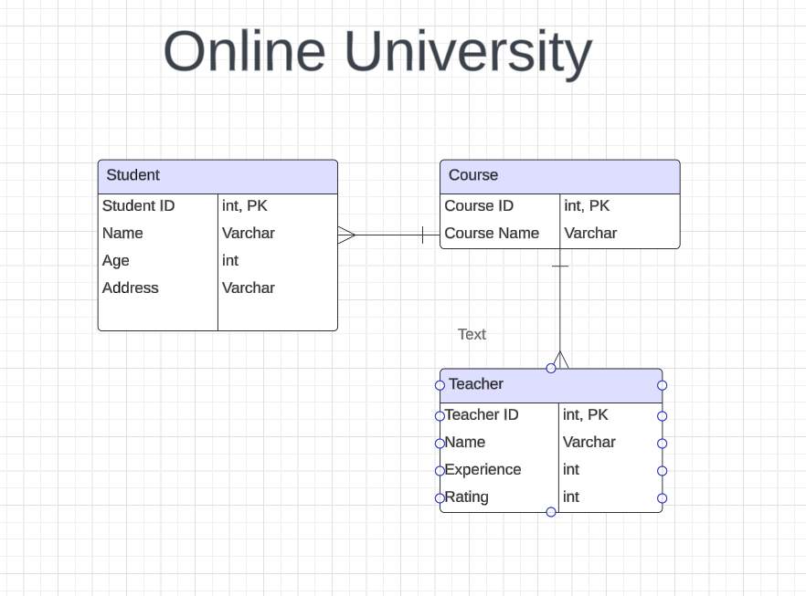

# Online University

This is a Backend Web API project developed in .NET that uses SQL server, to help Users/Students register for Courses in OnlineUniversity.

## Project Members

- Vamsi Gurram

## Project Requirements

- Application must build and run.
- Unit Testing (20% code coverage for Services and Models layer)
- Backend hosted on Azure Cloud Service

## Tech Stack

- C# (Back End Programming Language)
- SQL Server
- EF Core (ORM Tech)
- ASP.NET (Web API Framework)

## User Stories

- User should be able to register if they do not have an account
- User should be able to enroll/add any course
- User should be able to list all the classes he/she enrolled
- User should be able to un-enroll the courses.
- User should be able to list the courses available to enroll into.
- User should be able to see the faculty details teaching those courses.

## Tables

## MVP Goals

- Students can register to the Online University
- Students can enrol to any course
- Students can un-enroll from any course

## Stretch Goals

- Teachers should also be able to check the list of students enrolled in their class
- Teachers can teach multiple courses (Currently 1 course - 1 teacher in MVP)
