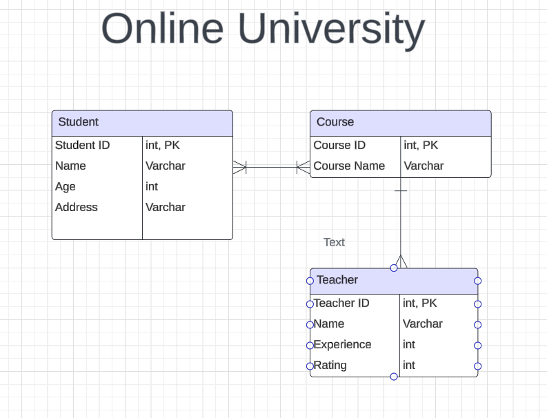

# Pokemon Showdown Teams Builder

This is a Full Stack Web App made in .NET to help Users/Students register for Courses in OnlineUniversity.

## Project Members

- Vamsi Gurram

## Project Requirements

- Application must build and run.
- Unit Testing (70% code coverage for Services and Models layer)
- Backend hosted on Azure Cloud Service

## Tech Stack

- React/JS (Front End)
- C# (Back End Programming Language)
- SQL Server (Azure Hosted)
- EF Core (ORM Tech)
- ASP.NET (Web API Framework)
- HTML, CSS
  - Bootstrap? Tailwind?

## User Stories

- User should be able to login/logout if they already have an account
- User should be able to register if they do not have an account
- User should be able to enroll/add any course
- User should be able to list all the classes he/she enrolled
- User should be able to un-enroll the courses.
- User should be able to list the courses available to enroll into.
- User should be able to see the faculty details teaching those courses.

## Tables

